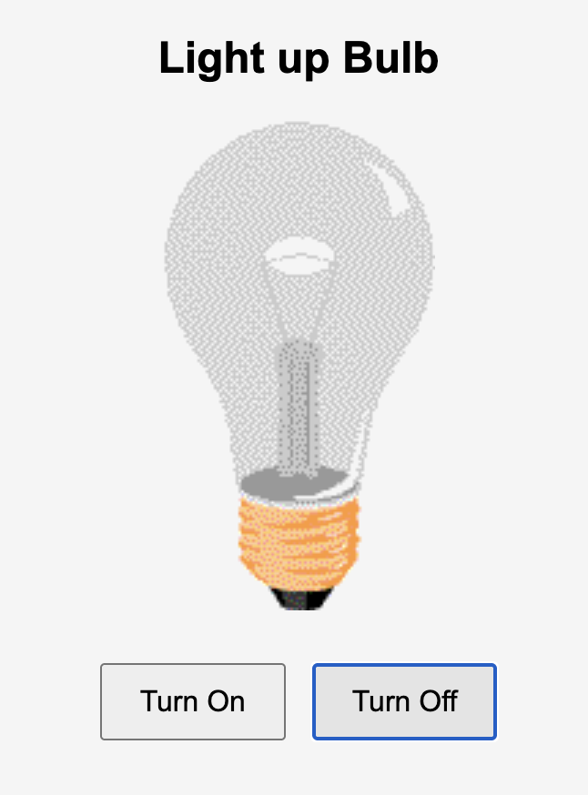

# 💡 Light Bulb On/Off

### This project demonstrates a simple light bulb control using HTML, CSS & JavaScript.

# 🔗 Live Demo of Project
[View Project](https://vermillion-sunflower-21bf22.netlify.app/) 🚀 

## 📌 Features
- Two buttons: Turn On and Turn Off
- Dynamically changes the bulb image using JavaScript
- can implement DOM manipulation

## 🛠️ Tech Stack
HTML
CSS
JavaScript

# 📸 Snapshot of the project

  
  

