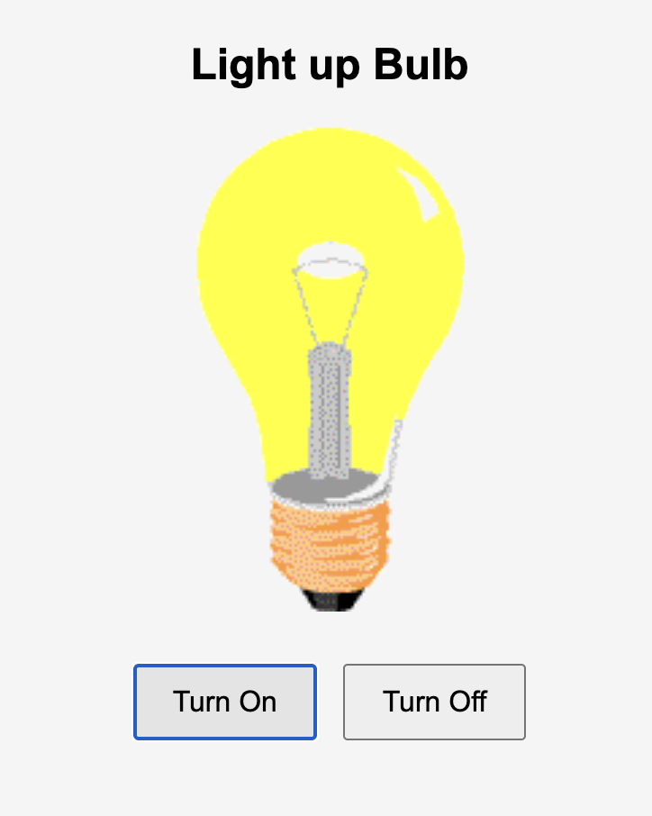

# 💡 Light Bulb On/Off

### This project demonstrates a simple light bulb control using HTML, CSS & JavaScript.

### Click the buttons to turn the bulb ON or OFF ,its a fun beginner-friendly DOM manipulation project.

## 📌 Features

- Two buttons: Turn On and Turn Off

- Dynamically changes the bulb image using JavaScript

- can implement DOM manipulation

## 🛠️ Tech Stack

HTML

CSS

JavaScript

# 🔗 Live Demo of Project
[View Project](https://vermillion-sunflower-21bf22.netlify.app/) 🚀 

# 📸 Snapshot of the project

  
  

